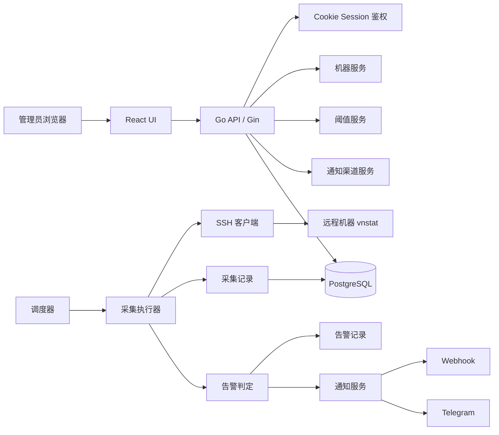

# traffic-monitor 架构方案

## 1. 项目概述

`traffic-monitor` 是一个面向个人运维场景的远程机器流量监控服务。系统通过 `SSH` 登录远程机器，执行 `vnstat` 采集指定网卡的小时流量和日流量，基于全局阈值和单机覆盖阈值判断上行、下行、总流量是否超限，并通过 `Webhook` 或 `Telegram` 发送通知。系统提供 Web 管理界面，支持机器管理、阈值配置、通知配置、采集结果查看和告警记录查看。

## 2. 业务需求

### 2.1 MVP 功能清单

| 优先级 | 模块 | 功能 |
| --- | --- | --- |
| P0 | 认证 | 管理员账号密码登录，使用 Cookie Session |
| P0 | 机器管理 | 新增、编辑、删除远程机器；配置主机、端口、用户、网卡、启用状态 |
| P0 | SSH Key 管理 | 支持导入已有私钥；支持系统新建 SSH keypair 并展示公钥 |
| P0 | 流量采集 | 定时通过 SSH 执行 `vnstat`，采集小时和日流量 |
| P0 | 阈值配置 | 支持全局阈值；支持单机覆盖阈值 |
| P0 | 阈值维度 | 支持小时/日、上行/下行/总流量三个维度 |
| P0 | 通知 | 支持 `Webhook` 和 `Telegram`，按配置启用 |
| P0 | 告警去重 | 当前小时超限只通知一次；当前日超限只通知一次 |
| P0 | 日志/记录 | 未启用通知时仍保留告警日志和告警记录 |
| P1 | Dashboard | 查看机器最近状态、最近采集结果、最近告警摘要 |
| P1 | 运维能力 | 启动自动 migrate、手动触发采集、机器连接测试 |

### 2.2 非目标

- 不做多租户
- 不做恢复通知
- 第一阶段不支持 SSH 密码登录
- 第一阶段不支持 `sudo` 执行 `vnstat`
- 第一阶段不支持单机多网卡聚合

## 3. 系统架构

### 3.1 架构风格

采用单体服务架构，包含以下组成部分：

- `HTTP API`：提供管理后台接口和内嵌前端资源
- `Scheduler`：按照配置频率触发采集任务
- `Collector`：并发执行远程 SSH 采集
- `Evaluator`：负责阈值计算、告警去重和记录落库
- `Notifier`：负责 `Webhook` 和 `Telegram` 发送
- `PostgreSQL`：保存配置、采集记录、告警记录、Session 数据

### 3.2 架构图

### 3.3 分层设计

严格遵循 `Handler -> Service -> Repository -> Model/DTO`：

- `Handler`：参数绑定、校验、统一响应、鉴权
- `Service`：业务编排、事务、阈值解析、告警决策
- `Repository`：数据库读写
- `Model/DTO`：数据库实体与接口数据结构分离

## 4. 技术栈决策

| 分类 | 选型 | 原因 |
| --- | --- | --- |
| 后端语言 | `Go` | 适合常驻服务、并发 SSH、单二进制部署 |
| HTTP 框架 | `Gin` | 与团队规则一致，适合管理型 API |
| 依赖注入 | `Uber Fx` | 便于装配 HTTP、调度器、Repo、通知器 |
| 配置管理 | `Viper` | 支持配置文件和环境变量组合 |
| 数据库 | `PostgreSQL` | 适合保存采集历史、告警记录和配置数据 |
| ORM | `GORM` | 快速实现 CRUD 和自动 migrate |
| 日志 | `Zerolog` | 结构化日志，适合采集链路排障 |
| 前端 | `React + Vite` | 适合后台管理界面，构建产物可被 `embed` |
| Session | Cookie Session | 自用后台更简单，避免 JWT 复杂度 |
| SSH | `golang.org/x/crypto/ssh` | 成熟稳定，可控性强 |
| 密码哈希 | `bcrypt` | 满足管理员密码安全要求 |

## 5. 模块划分

### 5.1 后端模块

| 模块 | 职责 |
| --- | --- |
| `auth` | 登录、登出、Session 校验、管理员初始化 |
| `machine` | 机器信息管理、SSH 连接测试、网卡配置 |
| `sshkey` | 私钥导入、keypair 生成、私钥加密存储 |
| `policy` | 全局阈值和单机覆盖阈值管理 |
| `collector` | `vnstat` 命令执行、输出解析、采集结果入库 |
| `scheduler` | 周期触发、并发控制、任务超时管理 |
| `alert` | 阈值判定、告警去重、告警状态持久化 |
| `notification` | `Webhook` 和 `Telegram` 渠道发送 |
| `dashboard` | 汇总机器状态、最近采集结果和告警统计 |
| `system` | 配置加载、DB 初始化、自动 migrate、健康检查 |

### 5.2 前端页面

- 登录页
- Dashboard
- 机器列表页
- 机器编辑页
- SSH Key 管理区域
- 全局阈值配置页
- 单机阈值配置页
- 通知渠道配置页
- 采集记录页
- 告警记录页

## 6. 数据模型

### 6.1 实体列表

#### `admins`

| 字段 | 说明 |
| --- | --- |
| `id` | 主键 |
| `username` | 管理员用户名，唯一 |
| `password_hash` | `bcrypt` 哈希 |
| `created_at` | 创建时间 |
| `updated_at` | 更新时间 |

#### `machines`

| 字段 | 说明 |
| --- | --- |
| `id` | 主键 |
| `name` | 机器名称 |
| `host` | IP 或域名 |
| `port` | SSH 端口 |
| `ssh_user` | SSH 用户 |
| `network_interface` | 监控网卡，如 `eth0` |
| `ssh_key_id` | 关联 SSH Key |
| `collect_enabled` | 是否启用采集 |
| `remark` | 备注 |
| `created_at` | 创建时间 |
| `updated_at` | 更新时间 |

#### `ssh_keys`

| 字段 | 说明 |
| --- | --- |
| `id` | 主键 |
| `name` | key 名称 |
| `source_type` | `imported` 或 `generated` |
| `public_key` | 公钥文本 |
| `private_key_ciphertext` | 使用主密钥加密后的私钥 |
| `fingerprint` | 指纹 |
| `created_at` | 创建时间 |
| `updated_at` | 更新时间 |

#### `global_threshold_rules`

| 字段 | 说明 |
| --- | --- |
| `id` | 主键 |
| `period_type` | `hourly` 或 `daily` |
| `metric_type` | `upload`、`download`、`total` |
| `threshold_mb` | 阈值，统一转为 MB 存储 |
| `enabled` | 是否启用 |
| `created_at` | 创建时间 |
| `updated_at` | 更新时间 |

#### `machine_threshold_rules`

| 字段 | 说明 |
| --- | --- |
| `id` | 主键 |
| `machine_id` | 机器 ID |
| `period_type` | `hourly` 或 `daily` |
| `metric_type` | `upload`、`download`、`total` |
| `threshold_mb` | 覆盖阈值 |
| `enabled` | 是否启用 |
| `created_at` | 创建时间 |
| `updated_at` | 更新时间 |

#### `collection_configs`

| 字段 | 说明 |
| --- | --- |
| `id` | 主键 |
| `interval_seconds` | 采集频率 |
| `ssh_timeout_seconds` | SSH 超时 |
| `command_timeout_seconds` | 命令超时 |
| `max_workers` | 并发采集数量 |
| `retry_times` | 重试次数 |
| `created_at` | 创建时间 |
| `updated_at` | 更新时间 |

#### `traffic_samples`

| 字段 | 说明 |
| --- | --- |
| `id` | 主键 |
| `machine_id` | 机器 ID |
| `period_type` | `hourly` 或 `daily` |
| `bucket_time` | 当前小时或当日桶起始时间 |
| `upload_mb` | 上行流量 |
| `download_mb` | 下行流量 |
| `total_mb` | 总流量 |
| `raw_payload` | 原始解析结果，便于排障 |
| `collected_at` | 采集时间 |

#### `notification_channels`

| 字段 | 说明 |
| --- | --- |
| `id` | 主键 |
| `channel_type` | `webhook` 或 `telegram` |
| `enabled` | 是否启用 |
| `config_json` | 渠道配置 |
| `created_at` | 创建时间 |
| `updated_at` | 更新时间 |

#### `alerts`

| 字段 | 说明 |
| --- | --- |
| `id` | 主键 |
| `machine_id` | 机器 ID |
| `period_type` | `hourly` 或 `daily` |
| `metric_type` | `upload`、`download`、`total` |
| `bucket_time` | 告警桶时间 |
| `threshold_mb` | 阈值 |
| `actual_mb` | 实际值 |
| `alert_key` | 去重键，唯一 |
| `notify_status` | `pending`、`sent`、`failed`、`skipped` |
| `created_at` | 创建时间 |

#### `notification_deliveries`

| 字段 | 说明 |
| --- | --- |
| `id` | 主键 |
| `alert_id` | 告警 ID |
| `channel_type` | 渠道类型 |
| `success` | 是否成功 |
| `response_excerpt` | 响应摘要 |
| `error_message` | 错误信息 |
| `created_at` | 创建时间 |

## 7. 接口设计概览

### 7.1 认证

- `POST /api/v1/auth/login`
- `POST /api/v1/auth/logout`
- `GET /api/v1/auth/profile`

### 7.2 机器管理

- `GET /api/v1/machines`
- `POST /api/v1/machines`
- `GET /api/v1/machines/:id`
- `PATCH /api/v1/machines/:id`
- `DELETE /api/v1/machines/:id`
- `POST /api/v1/machines/:id/test-connection`

### 7.3 SSH Key 管理

- `GET /api/v1/ssh-keys`
- `POST /api/v1/ssh-keys/import`
- `POST /api/v1/ssh-keys/generate`
- `GET /api/v1/ssh-keys/:id/public-key`
- `DELETE /api/v1/ssh-keys/:id`

### 7.4 阈值管理

- `GET /api/v1/thresholds/global`
- `PUT /api/v1/thresholds/global`
- `GET /api/v1/machines/:id/thresholds`
- `PUT /api/v1/machines/:id/thresholds`

### 7.5 通知管理

- `GET /api/v1/notification-channels`
- `PUT /api/v1/notification-channels/webhook`
- `PUT /api/v1/notification-channels/telegram`

### 7.6 采集与告警

- `GET /api/v1/traffic-samples`
- `GET /api/v1/alerts`
- `GET /api/v1/dashboard/summary`
- `POST /api/v1/system/collect-now`

## 8. 非功能性设计

### 8.1 安全

- 管理员密码使用 `bcrypt`
- Session 使用 `HttpOnly` Cookie
- SSH 私钥使用环境变量提供的主密钥加密存储
- 主密钥仅通过环境变量注入，如 `APP_MASTER_KEY`
- 日志中禁止输出密码、私钥原文、完整渠道密钥
- 所有写接口都走统一鉴权中间件

### 8.2 性能与并发

- 采集执行使用 worker pool，避免同时拉起过多 SSH 连接
- 单机采集带 SSH 超时和命令超时
- 采集结果和告警记录建立必要索引
- 查询接口支持分页

### 8.3 可观测性

- 关键日志包含 `machine_id`、`host`、`period_type`、`metric_type`
- 记录采集成功率、失败原因、通知成功率
- 采集失败和通知失败都写结构化日志

### 8.4 启动与迁移

- 服务启动阶段自动执行数据库 migrate
- migrate 只做前向兼容变更，避免启动时破坏数据
- 启动时校验主密钥、数据库连接和管理员初始配置

## 9. 部署方案

### 9.1 部署形态

- `traffic-monitor` 服务以 Docker 容器运行
- `PostgreSQL` 使用独立容器或外部数据库
- 通过环境变量注入数据库连接、主密钥、管理员初始化配置

### 9.2 关键环境变量

| 变量 | 用途 |
| --- | --- |
| `APP_ENV` | 运行环境 |
| `HTTP_ADDR` | HTTP 监听地址 |
| `POSTGRES_DSN` | PostgreSQL 连接串 |
| `APP_MASTER_KEY` | SSH 私钥加密主密钥 |
| `SESSION_SECRET` | Session 签名密钥 |
| `INIT_ADMIN_USERNAME` | 初始管理员用户名 |
| `INIT_ADMIN_PASSWORD` | 初始管理员密码 |

### 9.3 交付物

- Dockerfile
- `docker-compose.yml`
- 示例配置文件
- 初始化说明

## 10. 任务分解

1. 项目脚手架与基础设施搭建
2. 认证与 Session 模块实现
3. SSH Key 管理与密钥加密实现
4. 机器管理与 SSH 连通性测试
5. 阈值配置模块实现
6. `vnstat` 采集、解析与持久化实现
7. 调度器与并发控制实现
8. 告警判定与去重通知实现
9. React 管理界面实现
10. Docker 交付与初始化配置完善

## 11. 风险登记

| 风险 | 说明 | 应对策略 |
| --- | --- | --- |
| `vnstat` 版本差异 | 远程机器输出格式可能不同 | 优先采用 JSON 输出并锁定支持版本 |
| SSH 环境不一致 | 远程账号可能无权限直接执行命令 | 在机器接入阶段提供连接测试 |
| 告警去重边界复杂 | 小时与日维度需要分别去重 | 设计稳定的 `alert_key` 唯一索引 |
| 密钥泄露风险 | 私钥和通知密钥都属于敏感数据 | 统一加密存储并严格日志脱敏 |
| 自启动 migrate 风险 | 错误变更可能影响线上数据 | 限制自动 migrate 范围并保守建模 |

## 12. 领域术语表

| 术语 | 定义 |
| --- | --- |
| 全局阈值 | 默认应用于全部机器的阈值规则 |
| 单机覆盖阈值 | 针对某一台机器单独配置的阈值规则 |
| 小时流量 | 当前小时聚合流量 |
| 日流量 | 当前自然日聚合流量 |
| 采集桶 | 某个小时或某一天对应的判定时间窗口 |
| 告警去重 | 同一采集桶超限只通知一次 |

## 13. ADR

### ADR-001：采用单体架构

- 背景：项目为个人自用，功能聚焦，部署目标是单机 Docker
- 决策：采用单体服务
- 结果：开发和运维成本最低，后续可按模块演进

### ADR-002：后端采用 Go

- 背景：服务需要长期运行，并发 SSH 和定时任务是核心路径
- 决策：使用 `Go`
- 结果：获得更好的部署体验和并发执行能力

### ADR-003：前端采用 React 并使用 embed

- 背景：需要一个可维护的 Web 管理界面，同时希望简化部署
- 决策：使用 `React + Vite` 构建前端产物，并通过 `Go embed` 内嵌
- 结果：单镜像即可交付，无需单独部署静态站点

### ADR-004：登录采用 Cookie Session

- 背景：系统只有管理员单用户场景，无需复杂前后端跨域鉴权
- 决策：使用 Cookie Session
- 结果：简化鉴权实现，降低前端管理 token 的复杂度

### ADR-005：SSH 仅支持 key 登录

- 背景：第一期需要控制安全边界和实现复杂度
- 决策：只支持导入私钥和系统生成 keypair，不支持密码登录
- 结果：实现更清晰，安全边界更稳定

### ADR-006：数据库启动自动 migrate

- 背景：项目以自部署和自维护为主
- 决策：服务启动自动执行 migrate
- 结果：部署步骤更少，但需要严格控制 schema 变更方式
